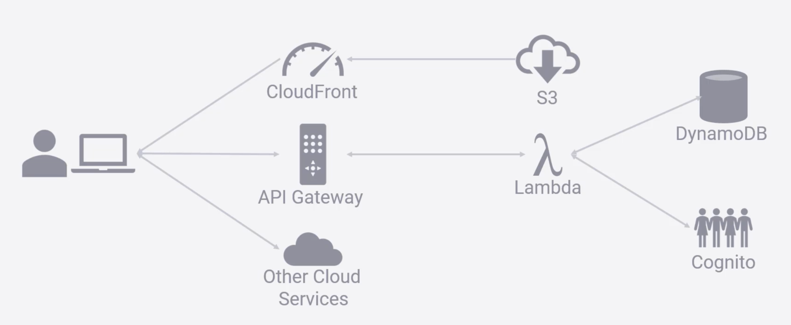

## Description

This diagram represents an AWS serverless architecture commonly used for web applications. Here's a breakdown of the components:

- User (Client): Represents the end-user accessing the application through a web browser or any other client device.

- CloudFront: An AWS Content Delivery Network (CDN) that delivers the web content to the user with low latency by caching copies closer to the user's location. It's often used to serve static files (like HTML, CSS, JavaScript) stored in S3.

- S3 (Simple Storage Service): AWS storage service used to store static assets such as images, videos, and other files that can be served to the client. In this architecture, it's typically used to host static websites or content.

- API Gateway: A managed service that allows developers to create, publish, maintain, monitor, and secure APIs. It acts as the "front door" for applications to access backend services, including Lambda functions, other AWS services, and third-party APIs.

- Lambda: AWS Lambda is a compute service that lets you run code without provisioning or managing servers. In this architecture, Lambda functions are triggered by the API Gateway to process incoming requests and interact with other AWS services like DynamoDB and Cognito.

- DynamoDB: A managed NoSQL database service provided by AWS. It's used to store and retrieve data needed by the application. The Lambda function would interact with DynamoDB to perform CRUD operations.

- Cognito: AWS Cognito provides authentication, authorization, and user management. It allows the application to manage users, create sign-up and sign-in pages, and integrate with identity providers like Google or Facebook.

- Other Cloud Services: This represents any other AWS services that might be part of the architecture

## Flow

- The user accesses the application via the client device.
- Static content (like HTML, CSS, JS) is delivered to the user via CloudFront, pulling from S3.
- When the user interacts with the application (e.g., submitting a form or requesting data), API - - Gateway routes the request to the appropriate Lambda function.
- The Lambda function processes the request, potentially interacting with DynamoDB for data storage/retrieval or Cognito for user authentication.
- The processed data or response is then returned to the user through the API Gateway.
- This setup is typical for a serverless web application, providing a scalable, cost-efficient, and highly available solution.
